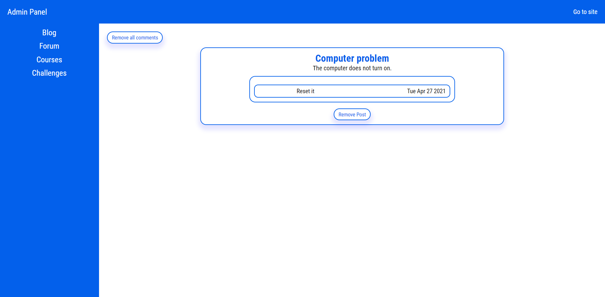

# Blog

I used React, Redux and Styled Components libraries to write this application. This application is simple blog. Admin can add content in panel and it shows on blog page. Is is simple CMS.

## Adding courses

Admin can also add courses, blog post and in the future challenges.

Admin also see content which is on the blog page.

## Adding post

You can see the details of post on blog. You can remove it too.

## Adding to portfolio

You can add each cryptocurrency to your portfolio to follow it.

## Blog page

User see all post, from admin panel.

## Courses page 

User can see all courses, which admin add.

## Forum page

Users can add post on forum.

Other users can comment posts on forum and help in solving problems.

Admin can remove all posts on forum and all comments.

